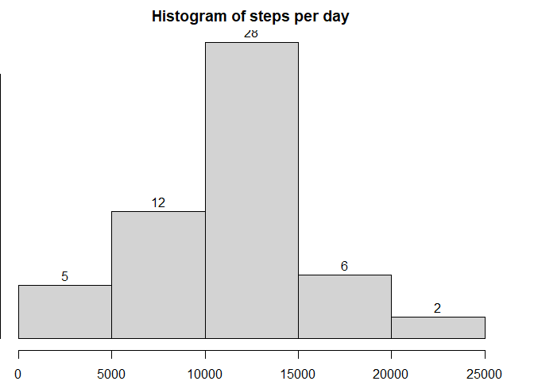
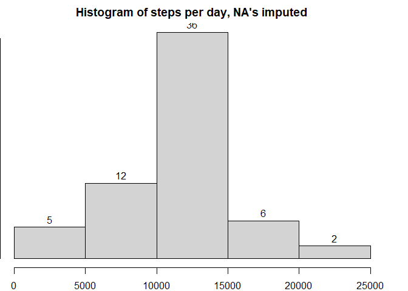

\ 
\ 

## Loading and preprocessing the data

```r
data <- read.csv(unzip("activity.zip"))
data$date <- as.Date(data$date)
```
\ 
\ 

## What is mean total number of steps taken per day?

```r
par(mar=c(2,0,2,2))
steps_per_day <- aggregate(x = data$steps, by = list(data$date), FUN=sum)
hist(steps_per_day$x, main="Histogram of steps per day", xlab="steps", labels=TRUE)
```

<!-- -->

Mean steps per day:

```r
mean(steps_per_day$x, na.rm = TRUE)
```

```
## [1] 10766.19
```
\ 

Median steps per day:

```r
median(steps_per_day$x, na.rm = TRUE)
```

```
## [1] 10765
```
\ 
\ 

## What is the average daily activity pattern?

```r
mean_activity <- aggregate(x = data$steps, by = list(data$interval), FUN=function(x) mean(x, na.rm = TRUE))
with(mean_activity, plot(x ~ Group.1, type='l'))
```

<!-- -->

Which 5-minute interval has the highest average number of steps?

```r
mean_activity[which.max(mean_activity$x),'Group.1']
```

```
## [1] 835
```
\ 
\ 

## Imputing missing values
How many NA's are there in the dataset?

```r
sum(is.na(data))
```

```
## [1] 2304
```
\ 

Replace all missing values with mean step value from all days for that 5-minute interval

```r
#For this part we break out dplyr since doing it with base R got kind of complicated
#the impute_mean function is based on code found on Stack Overflow
library(dplyr)
impute_mean <- function(x) replace(x, is.na(x), mean(x, na.rm = TRUE))
nona_data <- data %>% group_by(interval) %>% mutate(steps = impute_mean(steps))
```
\ 

Perform the histogram, mean and median analyses with the new dataset

```r
par(mar=c(2,0,2,2))
steps_per_day2 <- aggregate(x = nona_data$steps, by = list(nona_data$date), FUN=sum)
hist(steps_per_day2$x, main="Histogram of steps per day, NA's imputed", xlab="steps", labels=TRUE)
```

<!-- -->


```r
mean(steps_per_day2$x)
```

```
## [1] 10766.19
```
\ 


```r
median(steps_per_day2$x)
```

```
## [1] 10766.19
```
\ 
\ 

Conclusion: imputing the data had a minor impact on the median and no impact on the mean. The total number of steps (histogram) was mostly unchanged, but the 10 000 - 15 000 bin gained eight new members.

\ 
\ 

## Are there differences in activity patterns between weekdays and weekends?
\ 

Create a new variable to mark whether a date is on the weekend or not

```r
weekend=c("Saturday", "Sunday")
nona_data <- nona_data %>% mutate (is_weekend = as.factor(weekdays(date) %in% weekend))
levels(nona_data$is_weekend) <- c("weekday", "weekend")
plotdata <- nona_data %>% group_by(is_weekend, interval) %>%summarize(mean_step = mean(steps))
```

Plot steps vs interval, categorised by weekday or weekend:


```r
library(ggplot2)
qplot(x=interval, y=mean_step, facets = is_weekend ~ ., data=plotdata, geom="line", ylab="steps")
```

<!-- -->
